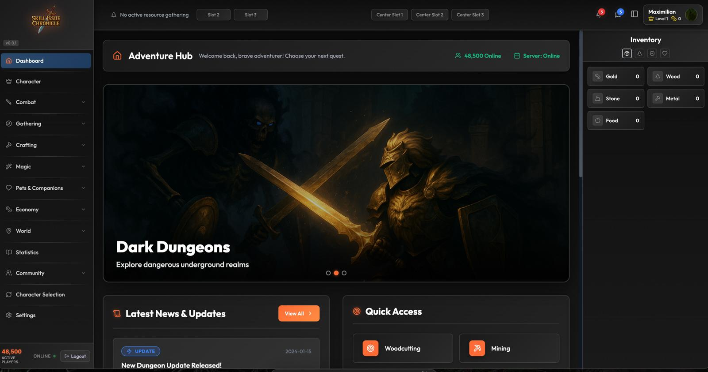
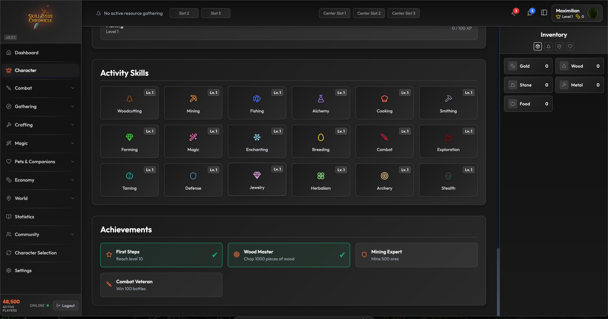
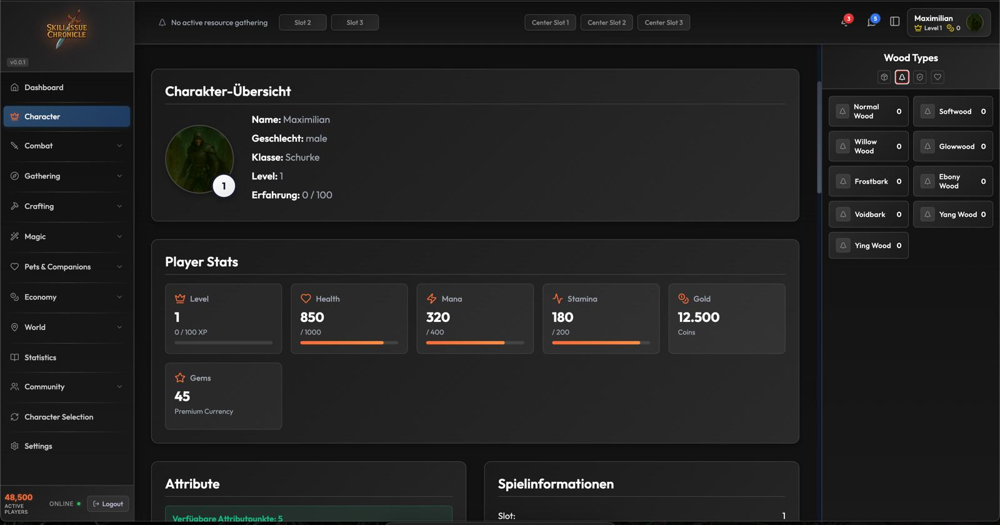
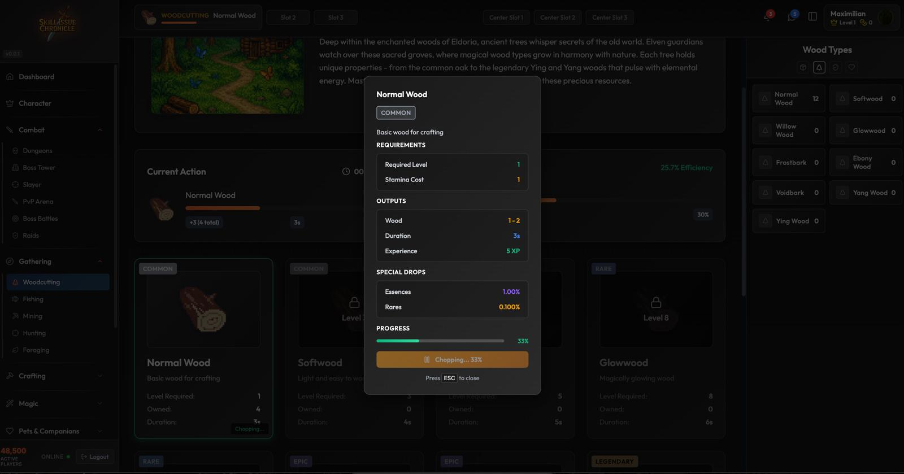
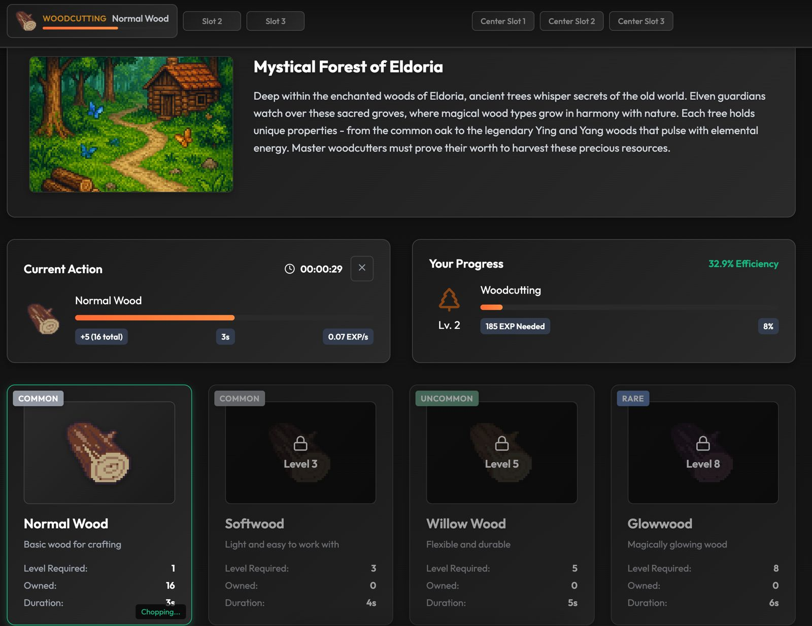
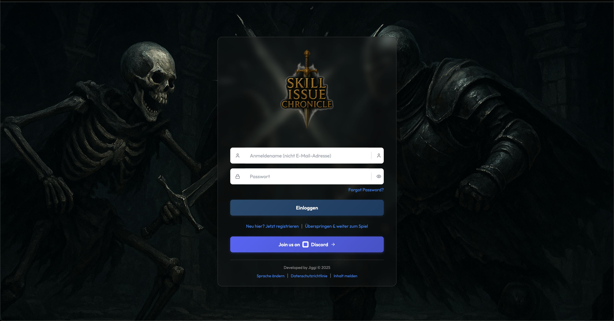
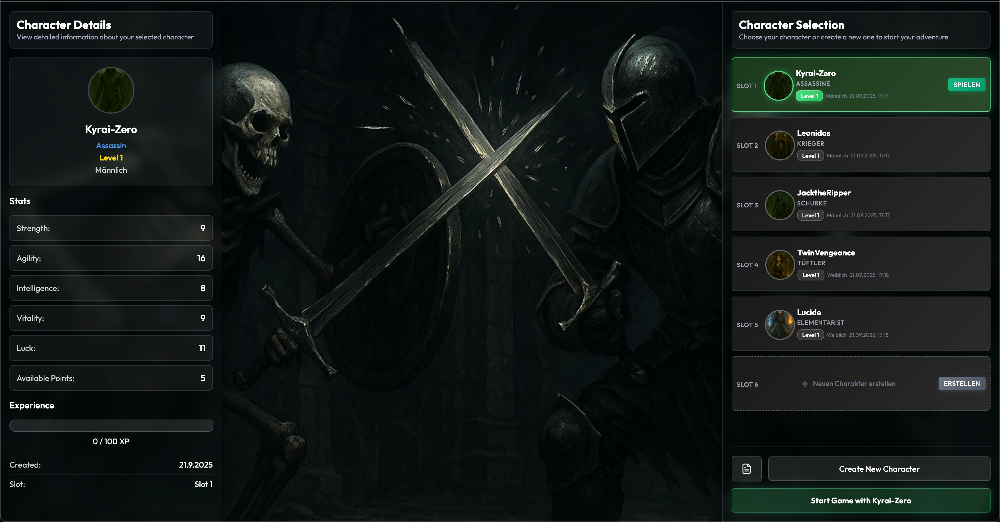
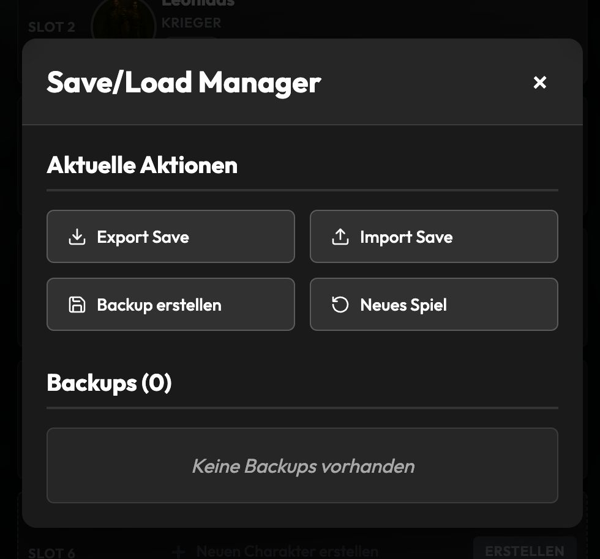

# Skill Issue Chronicles

**Alpha v0.0.1** - Skill Issue Chronicles

<a href="https://discord.gg/qwfa4c3bSH" target="_blank" rel="noopener noreferrer">
  
</a>
[](https://github.com/GylanSalih/Skill-Issue-Chronicles)
[](https://github.com/GylanSalih/Skill-Issue-Chronicles)

#

### ⚠️ Attention Developer

- **Interested in this project?** Explore the codebase and docs.  
- **Questions?** Reach out privately.  
- **Support Needed!** Contributions for this Idle RPG 🎮✨  

### ⚠️  Developer Documentation

- **[📖 Development Guide](docs/showcase/DEVELOPMENT_GUIDE.md)** – Complete setup and development workflow  
- **[📋 Changelog](docs/showcase/CHANGELOG.md)** – Version history and updates  
- **[🗺️ Roadmap](docs/showcase/ROADMAP.md)** – Future features and development goals  

#

## 📸 Screenshots

<div align="center">
  <table>
    <tr>
      <td align="center">
        
        <br><sub>Character Selection</sub>
      </td>
      <td align="center">
        
        <br><sub>Game Interface</sub>
      </td>
      <td align="center">
        
        <br><sub>Resource Management</sub>
      </td>
      <td align="center">
        
        <br><sub>Character Stats</sub>
      </td>
    </tr>
    <tr>
      <td align="center">
        
        <br><sub>Equipment System</sub>
      </td>
      <td align="center">
        
        <br><sub>Boss Combat</sub>
      </td>
      <td align="center">
        
        <br><sub>Game Dashboard</sub>
      </td>
      <td align="center">
        
        <br><sub>Activity Manager</sub>
      </td>
    </tr>
  </table>
</div>

## 🎮 Key Features

### Character Management

- **Character Creation** - 10 unique classes (Warrior, Mage, Rogue, etc.)
- **Character Selection** - Multiple character slots with detailed stats
- **Stat Allocation** - Customize character attributes
- **Character Progression** - Level up system with experience points

### Resource Management

- **Woodcutting System** - Gather different wood types with varying rarities
- **Resource Panel** - Real-time resource tracking and management
- **Save/Load System** - Persistent character and progress data
- **Inventory Management** - Equipment and item storage

### Game Systems

- **Activity Manager** - Automated resource gathering with timers
- **Boss Combat** - Turn-based combat system with different boss tiers
- **Pet System** - Collect and train pets with unique abilities
- **Statistics Tracking** - Detailed progress monitoring and analytics

## 🛠️ Core Managers & Systems

### Game State Management

**Path**: `src/hooks/useGameState.ts`

- **Global State** - Centralized game state management
- **Resource Tracking** - Primary/secondary resources with 15+ wood types
- **Character Stats** - Attack, defense, intelligence, stamina, melee, ranged, magic
- **Skill System** - Woodcutting, cooking, mining with experience tracking
- **Auto-save** - Persistent data storage with localStorage

### Save Manager

**Path**: `src/lib/saveManager.ts`

- **SaveData Interface** - Structured save file format
- **Load/Save Functions** - `loadGame()`, `saveGame()`, `createNewSave()`
- **Character Persistence** - Multiple character slots with metadata
- **Data Validation** - Error handling and data integrity
- **Export/Import** - JSON-based save file system

### Activity Manager

**Path**: `src/contexts/ActivityManager.tsx`

- **Skill Management** - Start/stop skills with experience tracking
- **Progress Calculation** - Real-time progress bars and timers
- **Efficiency System** - Skill-based efficiency calculations
- **Game Control** - Start/stop/toggle game state
- **Level Progression** - Experience requirements and level calculations

### Wood Manager

**Path**: `src/lib/woodManager.ts`

- **Session Management** - Active woodcutting sessions with timers
- **Event System** - Real-time session updates and listeners
- **Progress Tracking** - Time-based progress with stamina consumption
- **Result Calculation** - Wood type, amount, and experience rewards

### Equipment System

**Path**: `src/components/EquipmentInterface/EquipmentInterface.tsx`

- **10 Equipment Slots** - Helmet, amulet, weapon, chest, shield, legs, gloves, boots, ring, cape
- **Rarity System** - Common, uncommon, rare, epic, legendary with color coding
- **Stat Bonuses** - Defense, attack, magic, agility, health, mana, luck
- **Item Management** - Equip/unequip with stat calculations
- **Visual Interface** - Character silhouette with equipment slots

### Character Classes

**Path**: `src/config/characterClasses.ts`

- **10 Unique Classes** - Warrior, Mage, Rogue, Archer, Healer, Berserker, Paladin, Assassin, Tinkerer, Elementalist
- **Base Stats** - Starting attributes for each class
- **Class Stats** - Attack, defense, magic, speed, health, mana ratings
- **Helper Functions** - `getClassStats()`, `getClassBaseStats()`, `getAllCharacterClasses()`

### Boss Combat System

**Path**: `src/config/bossConfig.ts`, `src/hooks/useBossCombat.ts`

- **Boss Tower** - Multiple floors with increasing difficulty
- **Turn-based Combat** - Attack, defend, magic, special abilities
- **Rarity System** - Boss rarity affects rewards and difficulty
- **Reward System** - Experience, gold, and item drops
- **Combat State** - Real-time combat tracking and management

## 🚀 Installation

```bash
# Clone repository
git clone https://github.com/GylanSalih/Skill-Issue-Chronicles

# Install dependencies
npm install

# Start development server
npm run dev

# Build for production
npm run build
```

## 🛠️ Tech Stack

- **Frontend**: React 18 + TypeScript
- **Build**: Vite + SCSS Modules
- **State**: React Context + Custom Hooks
- **Routing**: React Router v6
- **Icons**: Lucide React
- **3D**: Three.js + React Three Fiber
- **Animations**: GSAP + React Spring
- **Deployment**: Vercel

## 📱 Available Scripts

- `npm run dev` - Start development server
- `npm run build` - Build for production
- `npm run preview` - Preview production build
- `npm run lint` - Run ESLint

## ⚠️ Alpha Status

This project is currently in **Alpha v0.0.1**. Features may be incomplete or subject to change.

## 🎯 Core Mechanics

### Character Classes

- **Warrior** - High defense and health
- **Mage** - High magic and mana
- **Rogue** - High speed and critical hits
- **Archer** - Ranged combat specialist
- **Healer** - Support and healing abilities
- **Berserker** - High damage, low defense
- **Paladin** - Balanced fighter with healing
- **Assassin** - Stealth and high damage
- **Tinkerer** - Technical abilities and traps
- **Elementalist** - Master of elemental magic

### Resource Gathering

- **Woodcutting** - Primary resource gathering activity
- **Rarity System** - Common to Legendary wood types
- **Time-based** - Automated gathering with progress bars
- **Experience Gain** - Skill progression through activities

## 👥 Contributors

<table>
  <tr>
    <td align="center">
      <a href="https://github.com/GylanSalih">
        
        <br />
        <b>Gylan Salih</b>
      </a>
    </td>
    <td align="center">
      
      <br />
      <b>Developer 2</b>
    </td>
    <td align="center">
      
      <br />
      <b>Developer 3</b>
    </td>
    <td align="center">
      
      <br />
      <b>Developer 4</b>
    </td>
  </tr>
</table>

---

**Status**: Alpha Development | **Version**: 0.0.1 | **Developers**: 4
